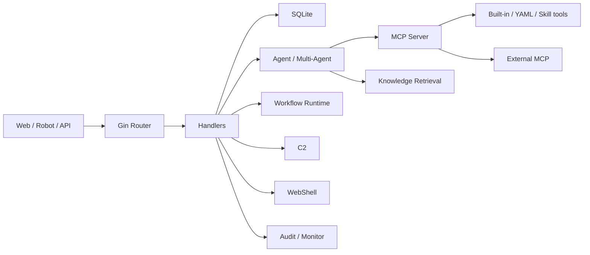

# Architecture

[中文](../zh-CN/architecture.md)

CyberStrikeAI is a single Go Web application with a static frontend, SQLite persistence, Agent orchestration, MCP tooling, workflow graphs, knowledge retrieval, and optional C2/WebShell subsystems.

## Overview

## Request Path

For `/api/eino-agent/stream`:

1. Gin route enters auth middleware.
2. Handler parses message, conversation, role, uploads, and WebShell context.
3. Agent builds model input: history, role prompt, project facts, tools.
4. Eino Runner calls the model.
5. Tool requests go through MCP.
6. HITL may interrupt before execution.
7. Tool results are saved to process details and monitoring.
8. Model continues and produces final text.
9. SSE streams progress and deltas to the browser.
10. Conversation and process details persist to SQLite.

This explains why a failure may live in auth, config, model, MCP, HITL, DB, SSE, or frontend rendering.

## Cross-Cutting Modules

- Project facts are injected into Agent context.
- HITL sits before tool execution.
- Monitor records tool execution and supports cancellation/review.
- Audit records platform management actions.
- Tool search controls what tools the model can currently see.

These are not just pages; they affect many runtime paths.

## Complexity Hotspots

- `internal/app/app.go`: service construction and route wiring.
- `internal/handler/config.go`: hot application of config across model, KB, C2, robot, MCP.
- `internal/multiagent/`: streaming, retry, summarization, middleware, tools.
- `internal/security/`: auth and shell execution boundary.
- `internal/database/`: SQLite schema compatibility.

## Design Trade-Offs

The project uses a single Go service, static frontend, and SQLite to keep deployment simple. The trade-offs:

- multi-instance scale is not automatic;
- runtime files must be backed up carefully;
- high-privilege tools and admin UI live in one process, so deployment isolation matters.

## Source Anchors

- App wiring: `internal/app/app.go`
- Handlers: `internal/handler/`
- Multi-agent: `internal/multiagent/`
- MCP: `internal/mcp/`
- DB: `internal/database/`
