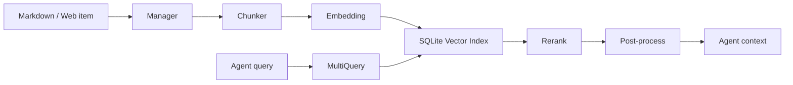

# Knowledge Base

[中文](../zh-CN/knowledge-base.md)

The knowledge base turns local security notes, playbooks, vulnerability guides, and organizational standards into retrievable context for Agents.

## Enable

```yaml
knowledge:
  enabled: true
  base_path: knowledge_base
  embedding:
    provider: openai
    model: text-embedding-v4
database:
  knowledge_db_path: data/knowledge.db
```

Keep the knowledge DB separate when you want portable reusable indexes.

## Internal Pipeline



Quality depends on source structure, chunk size, embedding quality, and rerank behavior.

## Content Writing

Bad:

```text
SQL injection is dangerous. Use sqlmap. Filter input.
```

Better:

```markdown
# MySQL UNION Injection Verification

## Preconditions
- Parameter is concatenated into SELECT.

## Steps
1. Use `order by` to infer column count.
2. Use `union select null,...` to find reflection.
3. Use read-only functions to confirm DB type.

## False Positives
- WAF error page.
- Generic error page.

## Fix
- Parameterized queries.
- Least DB privilege.
```

Structured headings and concrete steps improve chunking and retrieval.

## Tuning

Use a fixed test query set, then change one variable at a time:

- empty results: lower `similarity_threshold`, verify indexing;
- wrong topic: improve titles and category/risk type;
- broken context: tune `chunk_size` and `chunk_overlap`;
- noisy results: raise threshold or fix rerank;
- high cost: lower `multi_query.max_queries`, `prefetch_top_k`, or `top_k`.

## MCP Tools

Enabled KB registers tools such as:

- list risk types;
- search knowledge base.

Prompt roles to query the KB before giving vulnerability validation or remediation advice when unsure.

## Retrieval Logs

Use logs to improve content:

- frequent no-results queries: missing content or synonyms;
- low scores: titles/terms mismatch;
- duplicate hits: merge or categorize docs;
- Agent ignores results: output may be too long or not actionable.

## Source Anchors

- Manager: `internal/knowledge/manager.go`
- Index pipeline: `internal/knowledge/index_pipeline.go`
- Chunking: `internal/knowledge/chunk_eino.go`
- Retriever: `internal/knowledge/retriever.go`
- Eino chain: `internal/knowledge/eino_retrieve_chain.go`
- Rerank: `internal/knowledge/rerank_http.go`
- MCP tools: `internal/knowledge/tool.go`
